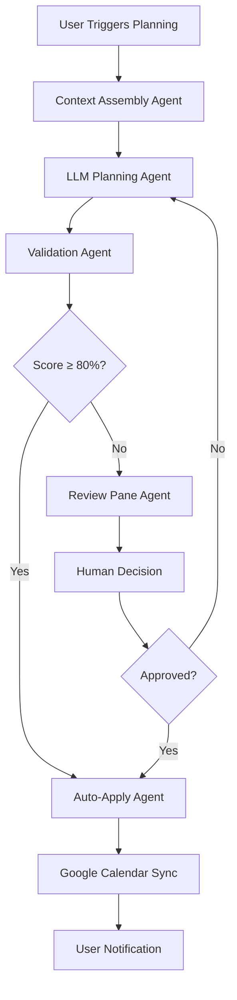

# BOB AI Planner - Agentic AI Documentation

## Overview

BOB's AI Planner is a sophisticated **agentic AI system** that autonomously manages calendar scheduling and time blocking. Unlike simple AI assistants that only respond to prompts, this system actively plans, validates, and manages your schedule with minimal human intervention.

## What is Agentic AI?

**Agentic AI** refers to AI systems that can:
- **Take autonomous actions** based on goals and constraints
- **Plan multi-step workflows** to achieve objectives  
- **Adapt and respond** to changing conditions
- **Make decisions** within defined parameters
- **Learn from feedback** and improve over time

## BOB's Agentic AI Architecture

### 1. **Context Assembly Agent**
**Location**: `functions/index.js` - `assemblePlanningContext()`

**Purpose**: Autonomously gathers all relevant planning data
- ✅ User's tasks, goals, and existing calendar blocks
- ✅ Google Calendar events and conflicts
- ✅ Planning preferences (wake/sleep times, quiet hours)
- ✅ Health data integration (HRV, sleep quality) 
- ✅ Theme targets (Health, Growth, Wealth, Tribe, Home)

### 2. **LLM Planning Agent** 
**Location**: `functions/index.js` - `generateAIPlan()`

**Purpose**: Uses GPT-4 to create optimal schedules
- ✅ **Intelligent Scheduling**: Considers task effort, priority, and energy levels
- ✅ **Constraint Awareness**: Respects existing appointments and preferences
- ✅ **Theme Optimization**: Balances weekly targets across life areas
- ✅ **Recovery Integration**: Adjusts based on health metrics

**LLM Prompt Strategy**:
```
You are an expert productivity planner. Create an optimal schedule that:
1. Maximizes productive time blocks
2. Avoids quiet hours
3. Respects existing calendar events
4. Balances weekly theme targets
5. Considers task effort and priority
```

### 3. **Validation Agent**
**Location**: `functions/index.js` - `validateCalendarBlocks()`

**Purpose**: Autonomously checks and scores proposed schedules
- ✅ **Conflict Detection**: Prevents double-booking and overlaps
- ✅ **Constraint Enforcement**: Validates wake/sleep and quiet hours
- ✅ **Quality Scoring**: Rates plan effectiveness (0-1 scale)
- ✅ **Error Reporting**: Provides specific feedback for improvements

**Validation Rules**:
- No overlap with hard blocks (existing appointments)
- All blocks within wake/sleep hours
- Respect quiet hours preferences
- Minimum recovery gaps between intense activities

### 4. **Auto-Apply Agent**
**Location**: `functions/index.js` - `applyCalendarBlocks()`

**Purpose**: Autonomously executes approved plans
- ✅ **Smart Thresholds**: Auto-applies high-scoring plans (≥80%)
- ✅ **Google Calendar Integration**: Creates real calendar events
- ✅ **Firestore Sync**: Updates local database with rationales
- ✅ **Rollback Capability**: Can undo applied changes

### 5. **Review Pane Agent**
**Location**: `react-app/src/components/PlanningDashboard.tsx`

**Purpose**: Provides human oversight for edge cases
- ✅ **Plan Visualization**: Shows proposed blocks with rationales
- ✅ **Validation Feedback**: Displays errors and warnings
- ✅ **User Override**: Allows manual approval/rejection
- ✅ **Learning Integration**: Feeds decisions back to improve future plans

## Agentic Workflow



## Autonomous Capabilities

### **Real-Time Adaptation**
- Monitors calendar changes and re-plans automatically
- Adapts to health data updates (poor HRV = lighter schedule)
- Responds to external calendar modifications

### **Intelligent Defaults**
- Learns from user preferences and past approvals
- Optimizes theme distribution based on historical patterns
- Suggests task breakdown and effort estimation

### **Proactive Planning**
- Generates plans for upcoming weeks automatically
- Suggests schedule adjustments for goal deadlines
- Identifies potential conflicts before they occur

## Integration Points

### **Health-Aware Scheduling**
- **HealthKit Integration**: Adjusts intensity based on HRV/sleep data
- **Recovery Prioritization**: Schedules lighter activities during poor health days
- **Circadian Optimization**: Aligns high-focus work with natural energy peaks

### **Google Calendar Bi-Directional Sync**
- **Write Capability**: Creates calendar events with proper metadata
- **Read Capability**: Respects existing appointments and constraints
- **Conflict Resolution**: Handles overlapping events intelligently

### **Goal-Aligned Planning**
- **Theme Distribution**: Ensures balanced progress across life areas
- **Deadline Awareness**: Prioritizes urgent goals and milestones
- **Progress Tracking**: Monitors completion rates and adjusts future plans

## User Control & Transparency

### **Explainable AI**
Every AI decision includes human-readable rationales:
- "Scheduled workout for 7 AM based on high HRV and no morning conflicts"
- "Moved deep work to 9 AM when energy levels are typically highest"
- "Reserved evening for family time to meet weekly Tribe target"

### **Override Mechanisms**
- Manual approval for low-confidence plans
- One-click plan rejection and re-generation
- Custom constraint addition (e.g., "no meetings on Friday mornings")

### **Learning Feedback**
- Tracks user approvals/rejections to improve future suggestions
- Adapts to seasonal preferences and changing life patterns
- Incorporates feedback from calendar actual vs. planned usage

## Technical Implementation

### **Backend Architecture**
- **Firebase Functions**: Serverless execution for planning logic
- **GPT-4 Integration**: Advanced language model for intelligent planning
- **Google Calendar API**: Bi-directional calendar synchronization
- **Firestore**: Real-time data storage and synchronization

### **Frontend Integration**
- **React Dashboard**: Real-time planning status and controls
- **TypeScript Types**: Strong typing for calendar blocks and constraints
- **Bootstrap UI**: Responsive interface for plan review and approval

## Future Enhancements

### **Advanced Learning**
- Machine learning from user behavior patterns
- Predictive scheduling based on recurring activities
- Seasonal and trend-based planning adjustments

### **Multi-Source Integration**
- Strava/fitness app integration for workout planning
- Email/Slack integration for automatic meeting detection
- Travel calendar integration for location-aware scheduling

### **Collaborative Planning**
- Family/team calendar coordination
- Shared goal planning and progress tracking
- Meeting optimization across multiple stakeholders

---

## Summary

BOB's AI Planner represents a true **agentic AI system** that goes far beyond simple chatbot functionality. It autonomously:

1. **Gathers** comprehensive planning context
2. **Generates** intelligent schedule proposals  
3. **Validates** plans against complex constraints
4. **Executes** approved schedules automatically
5. **Learns** from user feedback and outcomes

This creates a genuinely autonomous planning assistant that works continuously in the background, requiring minimal user intervention while maximizing productivity and life balance.

The system is designed to be **transparent**, **controllable**, and **adaptive** - ensuring users maintain agency while benefiting from AI-powered optimization of their most precious resource: time.
