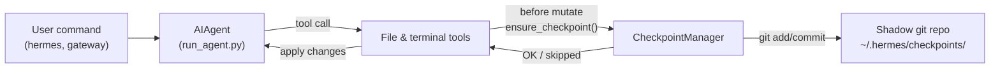

# Checkpoints and `/rollback`

Hermes Agent automatically snapshots your project before **destructive operations** and lets you restore it with a single command. Checkpoints are **enabled by default** — there's zero cost when no file-mutating tools fire.

This safety net is powered by an internal **Checkpoint Manager** that keeps a separate shadow git repository under `~/.hermes/checkpoints/` — your real project `.git` is never touched.

## What Triggers a Checkpoint

Checkpoints are taken automatically before:

- **File tools** — `write_file` and `patch`
- **Destructive terminal commands** — `rm`, `mv`, `sed -i`, `truncate`, `shred`, output redirects (`>`), and `git reset`/`clean`/`checkout`

The agent creates **at most one checkpoint per directory per turn**, so long-running sessions don't spam snapshots.

## Quick Reference

| Command | Description |
|---------|-------------|
| `/rollback` | List all checkpoints with change stats |
| `/rollback <N>` | Restore to checkpoint N (also undoes last chat turn) |
| `/rollback diff <N>` | Preview diff between checkpoint N and current state |
| `/rollback <N> <file>` | Restore a single file from checkpoint N |

## How Checkpoints Work

At a high level:

- Hermes detects when tools are about to **modify files** in your working tree.
- Once per conversation turn (per directory), it:
  - Resolves a reasonable project root for the file.
  - Initialises or reuses a **shadow git repo** tied to that directory.
  - Stages and commits the current state with a short, human‑readable reason.
- These commits form a checkpoint history that you can inspect and restore via `/rollback`.



## Configuration

Checkpoints are enabled by default. Configure in `~/.hermes/config.yaml`:

```yaml
checkpoints:
  enabled: true          # master switch (default: true)
  max_snapshots: 50      # max checkpoints per directory
```

To disable:

```yaml
checkpoints:
  enabled: false
```

When disabled, the Checkpoint Manager is a no‑op and never attempts git operations.

## Listing Checkpoints

From a CLI session:

```
/rollback
```

Hermes responds with a formatted list showing change statistics:

```text
📸 Checkpoints for /path/to/project:

  1. 4270a8c  2026-03-16 04:36  before patch  (1 file, +1/-0)
  2. eaf4c1f  2026-03-16 04:35  before write_file
  3. b3f9d2e  2026-03-16 04:34  before terminal: sed -i s/old/new/ config.py  (1 file, +1/-1)

  /rollback <N>             restore to checkpoint N
  /rollback diff <N>        preview changes since checkpoint N
  /rollback <N> <file>      restore a single file from checkpoint N
```

Each entry shows:

- Short hash
- Timestamp
- Reason (what triggered the snapshot)
- Change summary (files changed, insertions/deletions)

## Previewing Changes with `/rollback diff`

Before committing to a restore, preview what has changed since a checkpoint:

```
/rollback diff 1
```

This shows a git diff stat summary followed by the actual diff:

```text
test.py | 2 +-
 1 file changed, 1 insertion(+), 1 deletion(-)

diff --git a/test.py b/test.py
--- a/test.py
+++ b/test.py
@@ -1 +1 @@
-print('original content')
+print('modified content')
```

Long diffs are capped at 80 lines to avoid flooding the terminal.

## Restoring with `/rollback`

Restore to a checkpoint by number:

```
/rollback 1
```

Behind the scenes, Hermes:

1. Verifies the target commit exists in the shadow repo.
2. Takes a **pre‑rollback snapshot** of the current state so you can "undo the undo" later.
3. Restores tracked files in your working directory.
4. **Undoes the last conversation turn** so the agent's context matches the restored filesystem state.

On success:

```text
✅ Restored to checkpoint 4270a8c5: before patch
A pre-rollback snapshot was saved automatically.
(^_^)b Undid 4 message(s). Removed: "Now update test.py to ..."
  4 message(s) remaining in history.
  Chat turn undone to match restored file state.
```

The conversation undo ensures the agent doesn't "remember" changes that have been rolled back, avoiding confusion on the next turn.

## Single-File Restore

Restore just one file from a checkpoint without affecting the rest of the directory:

```
/rollback 1 src/broken_file.py
```

This is useful when the agent made changes to multiple files but only one needs to be reverted.

## Safety and Performance Guards

To keep checkpointing safe and fast, Hermes applies several guardrails:

- **Git availability** — if `git` is not found on `PATH`, checkpoints are transparently disabled.
- **Directory scope** — Hermes skips overly broad directories (root `/`, home `$HOME`).
- **Repository size** — directories with more than 50,000 files are skipped to avoid slow git operations.
- **No‑change snapshots** — if there are no changes since the last snapshot, the checkpoint is skipped.
- **Non‑fatal errors** — all errors inside the Checkpoint Manager are logged at debug level; your tools continue to run.

## Where Checkpoints Live

All shadow repos live under:

```text
~/.hermes/checkpoints/
  ├── <hash1>/   # shadow git repo for one working directory
  ├── <hash2>/
  └── ...
```

Each `<hash>` is derived from the absolute path of the working directory. Inside each shadow repo you'll find:

- Standard git internals (`HEAD`, `refs/`, `objects/`)
- An `info/exclude` file containing a curated ignore list
- A `HERMES_WORKDIR` file pointing back to the original project root

You normally never need to touch these manually.

## Best Practices

- **Leave checkpoints enabled** — they're on by default and have zero cost when no files are modified.
- **Use `/rollback diff` before restoring** — preview what will change to pick the right checkpoint.
- **Use `/rollback` instead of `git reset`** when you want to undo agent-driven changes only.
- **Combine with Git worktrees** for maximum safety — keep each Hermes session in its own worktree/branch, with checkpoints as an extra layer.

For running multiple agents in parallel on the same repo, see the guide on [Git worktrees](./git-worktrees.md).
