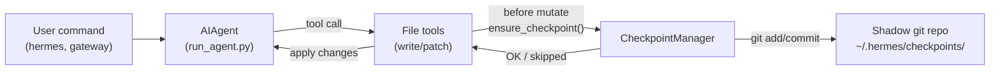

# Checkpoints and `/rollback`

Hermes Agent can automatically snapshot your project before **destructive operations** (like file write/patch tools) and restore it later with a single command.

This safety net is powered by an internal **Checkpoint Manager** that keeps a separate shadow git repository under `~/.hermes/checkpoints/` — your real project `.git` is never touched.

## How Checkpoints Work

At a high level:

- Hermes detects when tools are about to **modify files** in your working tree.
- Once per conversation turn (per directory), it:
  - Resolves a reasonable project root for the file.
  - Initialises or reuses a **shadow git repo** tied to that directory.
  - Stages and commits the current state with a short, human‑readable reason.
- These commits form a checkpoint history that you can inspect and restore via `/rollback`.

Internally, the Checkpoint Manager:

- Stores shadow repos under:
  - `~/.hermes/checkpoints/<hash>/`
- Keeps metadata about:
  - The original working directory (`HERMES_WORKDIR` file in the shadow repo).
  - Excluded paths such as:
    - `node_modules/`, `dist/`, `build/`
    - `.venv/`, `__pycache__/`, `*.pyc`
    - `.git/`, `.cache/`, `.pytest_cache/`, etc.

The agent creates **at most one checkpoint per directory per turn**, so long running sessions do not spam snapshots.



## Enabling Checkpoints

Checkpoints are controlled by a simple on/off flag and a maximum snapshot count **per directory**:

- `checkpoints_enabled` – master switch
- `checkpoint_max_snapshots` – soft cap on history depth per directory

You can configure these in `~/.hermes/config.yaml`:

```yaml
agent:
  checkpoints_enabled: true
  checkpoint_max_snapshots: 50
```

Or via CLI flags (exact wiring may depend on your version of the CLI):

```bash
hermes --checkpoints
# or
hermes chat --checkpoints
```

When disabled, the Checkpoint Manager is a no‑op and never attempts git operations.

## Listing Checkpoints

Hermes exposes an interactive way to list checkpoints for the current working directory.

From the CLI session where you are working on a project:

```bash
# Ask Hermes to show checkpoints for the current directory
/rollback
```

Hermes responds with a formatted list similar to:

```text
📸 Checkpoints for /path/to/project:

  1. a1b2c3d 2026-03-13 10:24  auto: before apply_patch
  2. d4e5f6a 2026-03-13 10:15  pre-rollback snapshot (restoring to a1b2c3d0)

Use /rollback <number> to restore, e.g. /rollback 1
```

Each entry shows:

- Short hash
- Timestamp
- Reason (commit message for the snapshot)

## Restoring with `/rollback`

Once you have identified the snapshot you want to go back to, use `/rollback` with the number from the list:

```bash
# Restore to the most recent snapshot
/rollback 1
```

Behind the scenes, Hermes:

1. Verifies the target commit exists in the shadow repo.
2. Takes a **pre‑rollback snapshot** of the current state so you can “undo the undo” later.
3. Runs `git checkout <hash> -- .` in the shadow repo, restoring tracked files in your working directory.

On success, Hermes responds with a short summary like:

```text
✅ Restored /path/to/project to a1b2c3d
Reason: auto: before apply_patch
```

If something goes wrong (missing commit, git error), you will see a clear error message and details will be logged.

## Safety and Performance Guards

To keep checkpointing safe and fast, Hermes applies several guardrails:

- **Git availability**
  - If `git` is not found on `PATH`, checkpoints are transparently disabled.
  - A debug log entry is emitted, but your session continues normally.
- **Directory scope**
  - Hermes skips overly broad directories such as:
    - Root (`/`)
    - Your home directory (`$HOME`)
  - This prevents accidental snapshots of your entire filesystem.
- **Repository size**
  - Before committing, Hermes performs a quick file count.
  - If the directory has more than a configured threshold (e.g. `50,000` files),
    checkpoints are skipped to avoid large git operations.
- **No‑change snapshots**
  - If there are no changes since the last snapshot, the checkpoint is skipped
    instead of committing an empty diff.

All errors inside the Checkpoint Manager are treated as **non‑fatal**: they are logged at debug level and your tools continue to run.

## Where Checkpoints Live

By default, all shadow repos live under:

```text
~/.hermes/checkpoints/
  ├── <hash1>/   # shadow git repo for one working directory
  ├── <hash2>/
  └── ...
```

Each `<hash>` is derived from the absolute path of the working directory. Inside each shadow repo you will find:

- Standard git internals (`HEAD`, `refs/`, `objects/`)
- An `info/exclude` file containing a curated ignore list
- A `HERMES_WORKDIR` file pointing back to the original project root

You normally never need to touch these manually; they are documented here so advanced users understand how the safety net works.

## Best Practices

- **Keep checkpoints enabled** for interactive development and refactors.
- **Use `/rollback` instead of `git reset`** when you want to undo agent‑driven changes only.
- **Combine with Git branches and worktrees** for maximum safety:
  - Keep each Hermes session in its own worktree/branch.
  - Let checkpoints act as an extra layer of protection on top.

For running multiple agents in parallel on the same repo without interfering with each other, see the dedicated guide on [Git worktrees](./git-worktrees.md).

