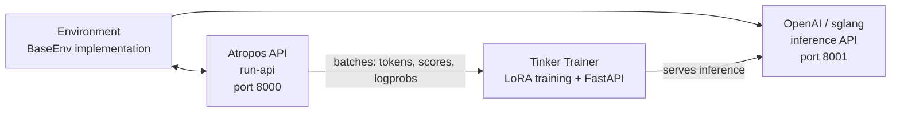

# RL Training

Hermes Agent includes an integrated RL (Reinforcement Learning) training pipeline built on **Tinker-Atropos**. This enables training language models on environment-specific tasks using GRPO (Group Relative Policy Optimization) with LoRA adapters, orchestrated entirely through the agent's tool interface.

## Overview

The RL training system consists of three components:

1. **Atropos** — A trajectory API server that coordinates environment interactions, manages rollout groups, and computes advantages
2. **Tinker** — A training service that handles model weights, LoRA training, sampling/inference, and optimizer steps
3. **Environments** — Python classes that define tasks, scoring, and reward functions (e.g., GSM8K math problems)

The agent can discover environments, configure training parameters, launch training runs, and monitor metrics — all through a set of `rl_*` tools.

## Requirements

RL training requires:

- **Python >= 3.11** (Tinker package requirement)
- **TINKER_API_KEY** — API key for the Tinker training service
- **WANDB_API_KEY** — API key for Weights & Biases metrics tracking
- The `tinker-atropos` submodule (at `tinker-atropos/` relative to the Hermes root)

```bash
# Set up API keys
hermes config set TINKER_API_KEY your-tinker-key
hermes config set WANDB_API_KEY your-wandb-key
```

When both keys are present and Python >= 3.11 is available, the `rl` toolset is automatically enabled.

## Available Tools

| Tool | Description |
|------|-------------|
| `rl_list_environments` | Discover available RL environments |
| `rl_select_environment` | Select an environment and load its config |
| `rl_get_current_config` | View configurable and locked fields |
| `rl_edit_config` | Modify configurable training parameters |
| `rl_start_training` | Launch a training run (spawns 3 processes) |
| `rl_check_status` | Monitor training progress and WandB metrics |
| `rl_stop_training` | Stop a running training job |
| `rl_get_results` | Get final metrics and model weights path |
| `rl_list_runs` | List all active and completed runs |
| `rl_test_inference` | Quick inference test using OpenRouter |

## Workflow

### 1. Discover Environments

```
List the available RL environments
```

The agent calls `rl_list_environments()` which scans `tinker-atropos/tinker_atropos/environments/` using AST parsing to find Python classes inheriting from `BaseEnv`. Each environment defines:

- **Dataset loading** — where training data comes from (e.g., HuggingFace datasets)
- **Prompt construction** — how to format items for the model
- **Scoring/verification** — how to evaluate model outputs and assign rewards

### 2. Select and Configure

```
Select the GSM8K environment and show me the configuration
```

The agent calls `rl_select_environment("gsm8k_tinker")`, then `rl_get_current_config()` to see all parameters.

Configuration fields are divided into two categories:

**Configurable fields** (can be modified):
- `group_size` — Number of completions per item (default: 16)
- `batch_size` — Training batch size (default: 128)
- `wandb_name` — WandB run name (auto-set to `{env}-{timestamp}`)
- Other environment-specific parameters

**Locked fields** (infrastructure settings, cannot be changed):
- `tokenizer_name` — Model tokenizer (e.g., `Qwen/Qwen3-8B`)
- `rollout_server_url` — Atropos API URL (`http://localhost:8000`)
- `max_token_length` — Maximum token length (8192)
- `max_num_workers` — Maximum parallel workers (2048)
- `total_steps` — Total training steps (2500)
- `lora_rank` — LoRA adapter rank (32)
- `learning_rate` — Learning rate (4e-5)
- `max_token_trainer_length` — Max tokens for trainer (9000)

### 3. Start Training

```
Start the training run
```

The agent calls `rl_start_training()` which:

1. Generates a YAML config file merging locked settings with configurable overrides
2. Creates a unique run ID
3. Spawns three processes:
   - **Atropos API server** (`run-api`) — trajectory coordination
   - **Tinker trainer** (`launch_training.py`) — LoRA training + FastAPI inference server on port 8001
   - **Environment** (`environment.py serve`) — the selected environment connecting to Atropos

The processes start with staggered delays (5s for API, 30s for trainer, 90s more for environment) to ensure proper initialization order.

### 4. Monitor Progress

```
Check the status of training run abc12345
```

The agent calls `rl_check_status(run_id)` which reports:

- Process status (running/exited for each of the 3 processes)
- Running time
- WandB metrics (step, reward mean, percent correct, eval accuracy)
- Log file locations for debugging

:::note Rate Limiting
Status checks are rate-limited to once every **30 minutes** per run ID. This prevents excessive polling during long-running training jobs that take hours.
:::

### 5. Stop or Get Results

```
Stop the training run
# or
Get the final results for run abc12345
```

`rl_stop_training()` terminates all three processes in reverse order (environment → trainer → API). `rl_get_results()` retrieves final WandB metrics and training history.

## Inference Testing

Before committing to a full training run, you can test if an environment works correctly using `rl_test_inference`. This runs a few steps of inference and scoring using OpenRouter — no Tinker API needed, just an `OPENROUTER_API_KEY`.

```
Test the selected environment with inference
```

Default configuration:
- **3 steps × 16 completions = 48 rollouts per model**
- Tests 3 models at different scales for robustness:
  - `qwen/qwen3-8b` (small)
  - `z-ai/glm-4.7-flash` (medium)
  - `minimax/minimax-m2.7` (large)
- Total: ~144 rollouts

This validates:
- Environment loads correctly
- Prompt construction works
- Inference response parsing is robust across model scales
- Verifier/scoring logic produces valid rewards

## Tinker API Integration

The trainer uses the [Tinker](https://tinker.computer) API for model training operations:

- **ServiceClient** — Creates training and sampling clients
- **Training client** — Handles forward-backward passes with importance sampling loss, optimizer steps (Adam), and weight checkpointing
- **Sampling client** — Provides inference using the latest trained weights

The training loop:
1. Fetches a batch of rollouts from Atropos (prompt + completions + scores)
2. Converts to Tinker Datum objects with padded logprobs and advantages
3. Runs forward-backward pass with importance sampling loss
4. Takes an optimizer step (Adam: lr=4e-5, β1=0.9, β2=0.95)
5. Saves weights and creates a new sampling client for next-step inference
6. Logs metrics to WandB

## Architecture Diagram



## Creating Custom Environments

To create a new RL environment:

1. Create a Python file in `tinker-atropos/tinker_atropos/environments/`
2. Define a class that inherits from `BaseEnv`
3. Implement the required methods:
   - `load_dataset()` — Load your training data
   - `get_next_item()` — Provide the next item to the model
   - `score_answer()` — Score model outputs and assign rewards
   - `collect_trajectories()` — Collect and return trajectories
4. Optionally define a custom config class inheriting from `BaseEnvConfig`

Study the existing `gsm8k_tinker.py` as a template. The agent can help you create new environments — it can read existing environment files, inspect HuggingFace datasets, and write new environment code.

## WandB Metrics

Training runs log to Weights & Biases with these key metrics:

| Metric | Description |
|--------|-------------|
| `train/loss` | Training loss (importance sampling) |
| `train/learning_rate` | Current learning rate |
| `reward/mean` | Mean reward across groups |
| `logprobs/mean` | Mean reference logprobs |
| `logprobs/mean_training` | Mean training logprobs |
| `logprobs/diff` | Logprob drift (reference - training) |
| `advantages/mean` | Mean advantage values |
| `advantages/std` | Advantage standard deviation |

## Log Files

Each training run generates log files in `tinker-atropos/logs/`:

```
logs/
├── api_{run_id}.log        # Atropos API server logs
├── trainer_{run_id}.log    # Tinker trainer logs
├── env_{run_id}.log        # Environment process logs
└── inference_tests/        # Inference test results
    ├── test_{env}_{model}.jsonl
    └── test_{env}_{model}.log
```

These are invaluable for debugging when training fails or produces unexpected results.
