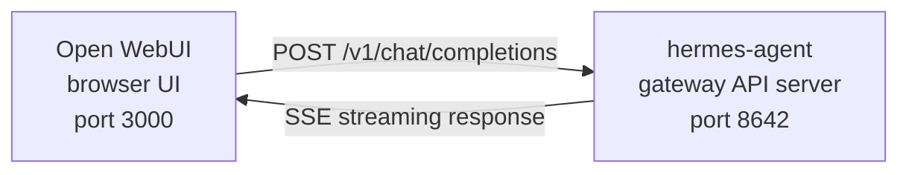

# Open WebUI Integration

[Open WebUI](https://github.com/open-webui/open-webui) (126k★) is the most popular self-hosted chat interface for AI. With Hermes Agent's built-in API server, you can use Open WebUI as a polished web frontend for your agent — complete with conversation management, user accounts, and a modern chat interface.

## Architecture



Open WebUI connects to Hermes Agent's API server just like it would connect to OpenAI. Your agent handles the requests with its full toolset — terminal, file operations, web search, memory, skills — and returns the final response.

Open WebUI talks to Hermes server-to-server, so you do not need `API_SERVER_CORS_ORIGINS` for this integration.

## Quick Setup

### 1. Enable the API server

Add to `~/.hermes/.env`:

```bash
API_SERVER_ENABLED=true
API_SERVER_KEY=your-secret-key
```

### 2. Start Hermes Agent gateway

```bash
hermes gateway
```

You should see:

```
[API Server] API server listening on http://127.0.0.1:8642
```

### 3. Start Open WebUI

```bash
docker run -d -p 3000:8080 \
  -e OPENAI_API_BASE_URL=http://host.docker.internal:8642/v1 \
  -e OPENAI_API_KEY=your-secret-key \
  --add-host=host.docker.internal:host-gateway \
  -v open-webui:/app/backend/data \
  --name open-webui \
  --restart always \
  ghcr.io/open-webui/open-webui:main
```

### 4. Open the UI

Go to **http://localhost:3000**. Create your admin account (the first user becomes admin). You should see your agent in the model dropdown (named after your profile, or **hermes-agent** for the default profile). Start chatting!

## Docker Compose Setup

For a more permanent setup, create a `docker-compose.yml`:

```yaml
services:
  open-webui:
    image: ghcr.io/open-webui/open-webui:main
    ports:
      - "3000:8080"
    volumes:
      - open-webui:/app/backend/data
    environment:
      - OPENAI_API_BASE_URL=http://host.docker.internal:8642/v1
      - OPENAI_API_KEY=your-secret-key
    extra_hosts:
      - "host.docker.internal:host-gateway"
    restart: always

volumes:
  open-webui:
```

Then:

```bash
docker compose up -d
```

## Configuring via the Admin UI

If you prefer to configure the connection through the UI instead of environment variables:

1. Log in to Open WebUI at **http://localhost:3000**
2. Click your **profile avatar** → **Admin Settings**
3. Go to **Connections**
4. Under **OpenAI API**, click the **wrench icon** (Manage)
5. Click **+ Add New Connection**
6. Enter:
   - **URL**: `http://host.docker.internal:8642/v1`
   - **API Key**: your key or any non-empty value (e.g., `not-needed`)
7. Click the **checkmark** to verify the connection
8. **Save**

Your agent model should now appear in the model dropdown (named after your profile, or **hermes-agent** for the default profile).

:::warning
Environment variables only take effect on Open WebUI's **first launch**. After that, connection settings are stored in its internal database. To change them later, use the Admin UI or delete the Docker volume and start fresh.
:::

## API Type: Chat Completions vs Responses

Open WebUI supports two API modes when connecting to a backend:

| Mode | Format | When to use |
|------|--------|-------------|
| **Chat Completions** (default) | `/v1/chat/completions` | Recommended. Works out of the box. |
| **Responses** (experimental) | `/v1/responses` | For server-side conversation state via `previous_response_id`. |

### Using Chat Completions (recommended)

This is the default and requires no extra configuration. Open WebUI sends standard OpenAI-format requests and Hermes Agent responds accordingly. Each request includes the full conversation history.

### Using Responses API

To use the Responses API mode:

1. Go to **Admin Settings** → **Connections** → **OpenAI** → **Manage**
2. Edit your hermes-agent connection
3. Change **API Type** from "Chat Completions" to **"Responses (Experimental)"**
4. Save

With the Responses API, Open WebUI sends requests in the Responses format (`input` array + `instructions`), and Hermes Agent can preserve full tool call history across turns via `previous_response_id`. When `stream: true`, Hermes also streams spec-native `function_call` and `function_call_output` items, which enables custom structured tool-call UI in clients that render Responses events.

:::note
Open WebUI currently manages conversation history client-side even in Responses mode — it sends the full message history in each request rather than using `previous_response_id`. The main advantage of Responses mode today is the structured event stream: text deltas, `function_call`, and `function_call_output` items arrive as OpenAI Responses SSE events instead of Chat Completions chunks.
:::

## How It Works

When you send a message in Open WebUI:

1. Open WebUI sends a `POST /v1/chat/completions` request with your message and conversation history
2. Hermes Agent creates an AIAgent instance with its full toolset
3. The agent processes your request — it may call tools (terminal, file operations, web search, etc.)
4. As tools execute, **inline progress messages stream to the UI** so you can see what the agent is doing (e.g. `` `💻 ls -la` ``, `` `🔍 Python 3.12 release` ``)
5. The agent's final text response streams back to Open WebUI
6. Open WebUI displays the response in its chat interface

Your agent has access to all the same tools and capabilities as when using the CLI or Telegram — the only difference is the frontend.

:::tip Tool Progress
With streaming enabled (the default), you'll see brief inline indicators as tools run — the tool emoji and its key argument. These appear in the response stream before the agent's final answer, giving you visibility into what's happening behind the scenes.
:::

## Configuration Reference

### Hermes Agent (API server)

| Variable | Default | Description |
|----------|---------|-------------|
| `API_SERVER_ENABLED` | `false` | Enable the API server |
| `API_SERVER_PORT` | `8642` | HTTP server port |
| `API_SERVER_HOST` | `127.0.0.1` | Bind address |
| `API_SERVER_KEY` | _(required)_ | Bearer token for auth. Match `OPENAI_API_KEY`. |

### Open WebUI

| Variable | Description |
|----------|-------------|
| `OPENAI_API_BASE_URL` | Hermes Agent's API URL (include `/v1`) |
| `OPENAI_API_KEY` | Must be non-empty. Match your `API_SERVER_KEY`. |

## Troubleshooting

### No models appear in the dropdown

- **Check the URL has `/v1` suffix**: `http://host.docker.internal:8642/v1` (not just `:8642`)
- **Verify the gateway is running**: `curl http://localhost:8642/health` should return `{"status": "ok"}`
- **Check model listing**: `curl http://localhost:8642/v1/models` should return a list with `hermes-agent`
- **Docker networking**: From inside Docker, `localhost` means the container, not your host. Use `host.docker.internal` or `--network=host`.

### Connection test passes but no models load

This is almost always the missing `/v1` suffix. Open WebUI's connection test is a basic connectivity check — it doesn't verify model listing works.

### Response takes a long time

Hermes Agent may be executing multiple tool calls (reading files, running commands, searching the web) before producing its final response. This is normal for complex queries. The response appears all at once when the agent finishes.

### "Invalid API key" errors

Make sure your `OPENAI_API_KEY` in Open WebUI matches the `API_SERVER_KEY` in Hermes Agent.

## Multi-User Setup with Profiles

To run separate Hermes instances per user — each with their own config, memory, and skills — use [profiles](/docs/user-guide/features/profiles). Each profile runs its own API server on a different port and automatically advertises the profile name as the model in Open WebUI.

### 1. Create profiles and configure API servers

```bash
hermes profile create alice
hermes -p alice config set API_SERVER_ENABLED true
hermes -p alice config set API_SERVER_PORT 8643
hermes -p alice config set API_SERVER_KEY alice-secret

hermes profile create bob
hermes -p bob config set API_SERVER_ENABLED true
hermes -p bob config set API_SERVER_PORT 8644
hermes -p bob config set API_SERVER_KEY bob-secret
```

### 2. Start each gateway

```bash
hermes -p alice gateway &
hermes -p bob gateway &
```

### 3. Add connections in Open WebUI

In **Admin Settings** → **Connections** → **OpenAI API** → **Manage**, add one connection per profile:

| Connection | URL | API Key |
|-----------|-----|---------|
| Alice | `http://host.docker.internal:8643/v1` | `alice-secret` |
| Bob | `http://host.docker.internal:8644/v1` | `bob-secret` |

The model dropdown will show `alice` and `bob` as distinct models. You can assign models to Open WebUI users via the admin panel, giving each user their own isolated Hermes agent.

:::tip Custom Model Names
The model name defaults to the profile name. To override it, set `API_SERVER_MODEL_NAME` in the profile's `.env`:
```bash
hermes -p alice config set API_SERVER_MODEL_NAME "Alice's Agent"
```
:::

## Linux Docker (no Docker Desktop)

On Linux without Docker Desktop, `host.docker.internal` doesn't resolve by default. Options:

```bash
# Option 1: Add host mapping
docker run --add-host=host.docker.internal:host-gateway ...

# Option 2: Use host networking
docker run --network=host -e OPENAI_API_BASE_URL=http://localhost:8642/v1 ...

# Option 3: Use Docker bridge IP
docker run -e OPENAI_API_BASE_URL=http://172.17.0.1:8642/v1 ...
```
